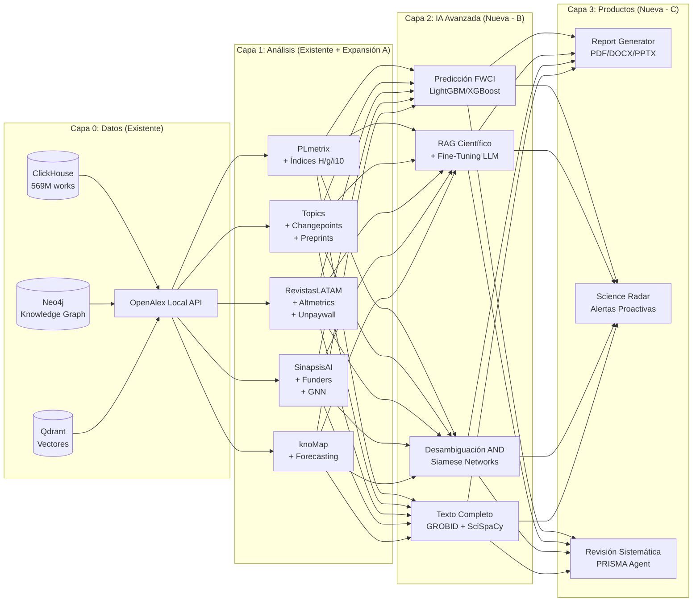

# Arquitectura Integral de Inteligencia Cienciométrica y Servicios MCP (Ecosistema UNAM)

**Autor:** Antigravity (Google DeepMind)**Fecha:** 21 de Agosto de 2026**Ecosistema Científico Integral Analizado (6 Proyectos):**

1. `knoMap` (`newLabSOM`): Laboratorio de Dinámica No Lineal, Facultad de Ciencias, UNAM (Topología Neuronal SOM, InCites, VOSviewer, Dim Reduction)
2. `SinapsisAI / RAGs` (`Proyectos/RAGs`): Hub de Inteligencia Bibliométrica Híbrida (SNII-First, Neo4j, ClickHouse, Qdrant, GraphRAG)
3. `Topics` (`Proyectos/Topics`): Detección Multimodal de Frentes de Investigación (Research Fronts v5.0), Geopolítica Científica y Taxonomía
4. `PLmetrix` (`Proyectos/PLmetrix-Lab-2.0`): Leyes Bibliométricas Clásicas (Lotka, Bradford, Zipf, Price) y Modelado de Crecimiento Científico
5. `RevistasLATAM` (`Proyectos/revistaslatam`): Inteligencia Editorial, Evaluación de Revistas Científicas, Acceso Abierto Diamante y Multilingüismo
6. `OpenAlex ClickHouse API` (`Proyectos/openalex-elastic-api`): Servidor Local de Alto Rendimiento OpenAlex sobre ClickHouse (569M trabajos, 337M autores)
   **Ubicación:** `docs/analisis_skills_mcp_knomap.md`

---

## 1. Resumen Ejecutivo: El Hexágono de Inteligencia Científica UNAM

El análisis conjunto de los seis proyectos consolida una **arquitectura de analítica y datos de clase mundial**:

```
┌────────────────────────────────────────────────────────────────────────────────────────────────────────────────────────────────────────────────────────┐
│                                                 HEXÁGONO INTEGRAL DE CIENCIOMETRÍA COMPUTACIONAL UNAM                                                  │
├──────────────────────────┬─────────────────────────────┬──────────────────────────────┬──────────────────────────────┬─────────────────────────────────┤
│ 1. OpenAlex Local API    │ 2. PLmetrix (Leyes)         │ 3. RevistasLATAM (Fuentes)   │ 4. SinapsisAI (RAGs)         │ 5. Topics (Frentes & Geopol)    │
│ Infraestructura Central  │ Modelado Matemático         │ Análisis de Revistas & OA    │ Big Data, Grafos y Padrón    │ Dinámica & Frentes Científicos  │
├──────────────────────────┼─────────────────────────────┼──────────────────────────────┼──────────────────────────────┼─────────────────────────────────┤
│ • ClickHouse (~569M docs)│ • Ley de Lotka (Autores)    │ • Métricas de Revistas (FWCI)│ • ClickHouse + Neo4j Graph   │ • Triple Detección Frentes:     │
│ • Token & Accent Search  │ • Ley de Bradford (Core)    │ • Vías OA (Diamond vs Gold)  │ • Qdrant (Búsqueda Vectorial)│   - Estructural (Leiden/Salton) │
│ • Normalización ROR/ORCID│ • Ley de Zipf (Palabras)    │ • Multilingüismo (ES/PT/EN)  │ • Padrón Oficial SNII/ORCID  │   - Semántico (SPECTER2/HDBSCAN)│
│ • Endpoints REST nativos │ • Índice de Price (Refs)    │ • Indexación DOAJ/SciELO     │ • Desambiguación con LLM     │   - Topológico (FastRP igraph)  │
│ • Sub-segundo en local   │ • Crecimiento Exp/Logístico │ • Benchmarking Editorial     │ • Métricas Masivas de Autor  │ • Geopolítica, Open Access, ODS │
└──────────────────────────┴─────────────────────────────┴──────────────────────────────┴──────────────────────────────┴─────────────────────────────────┘
                                                                │
                                                                ▼
                                      ┌──────────────────────────────────────────────────┐
                                      │ 6. knoMap (Motor Topológico y Visualización)     │
                                      ├──────────────────────────────────────────────────┤
                                      │ • Mapas Auto-Organizados de Kohonen (SOM)        │
                                      │ • U-Matrix, Component Planes y Frecuencias       │
                                      │ • Estimación de Dimensión Intrínseca (MLE skdim) │
                                      │ • Reducción Topológica No Lineal (UMAP)          │
                                      │ • InCites Profiles & PathSOM (Trayectorias)      │
                                      │ • Redes Relacionales VOSviewer & Louvain         │
                                      └──────────────────────────────────────────────────┘
```

---

## 2. Decisión Estratégica de Arquitectura: ¿Mantener `openalex-elastic-api` como API REST o Crear Servicios MCP?

### El Dilema

- **¿Solo API REST?** Permite que aplicaciones web (Streamlit, React de knoMap), balanceadores de carga y scripts batch descarguen miles/millones de registros en streaming. Sin embargo, obliga al Agente IA a construir llamadas complejas con URLs codificadas y lidiar con esquemas HTTP crudos.
- **¿Solo Servidor MCP?** Facilita que el Agente IA invoque herramientas con tipado estricto (`search_works`, `search_authors`), pero sobrecarga el protocolo JSON-RPC si se intenta mover conjuntos de datos masivos hacia los dashboards visuales.

### La Recomendación de Arquitectura Óptima: **Arquitectura Dual Híbrida (API REST Backend + MCP Gateway Wrapper)**

```
┌────────────────────────────────────────────────────────────────────────────────────────┐
│                      ARQUITECTURA DUAL RECOMENDADA (API REST + MCP GATEWAY)            │
├────────────────────────────────────────────────────────────────────────────────────────┤
│                                                                                        │
│   [Dashboards Streamlit]   [knoMap Frontend React]   [Pipelines Batch / Python]        │
│          │                         │                              │                    │
│          └─────────────────────────┼──────────────────────────────┘                    │
│                                    ▼ (HTTP / REST JSON)                                │
│                     ┌───────────────────────────────┐                                  │
│                     │   OpenAlex ClickHouse API     │  (localhost:5012 / dinamica)     │
│                     │  (openalex-elastic-api/Flask) │  [Capa Base de Infraestructura]  │
│                     └──────────────┬────────────────┘                                  │
│                                    ▲                                                   │
│                                    │ (Llamadas HTTP internas de alto rendimiento)      │
│                     ┌──────────────┴────────────────┐                                  │
│                     │  Servidor MCP: openalex-core  │                                  │
│                     │ (Gateway Agéntico JSON-RPC)   │                                  │
│                     └──────────────▲────────────────┘                                  │
│                                    │ (JSON-RPC Protocol)                               │
│                                    ▼                                                   │
│                     [Agente IA / Antigravity / IDE]                                    │
│                                                                                        │
└────────────────────────────────────────────────────────────────────────────────────────┘
```

#### Ventajas del Enfoque Dual:

1. **Mantener `openalex-elastic-api` como API REST de Infraestructura:**
   - Sirve como la **única fuente de verdad** (*Single Source of Truth*) para `revistaslatam`, `Topics`, `SinapsisAI` y `knoMap`.
   - Garantiza compatibilidad nativa con la librería `pyalex` (configurando `pyalex.config.api_url = "http://localhost:5012"`).
   - Mantiene la capacidad de procesamiento paralelo y streaming masivo.
2. **Crear un Servidor MCP Gateway (`openalex-clickhouse-gateway`):**
   - Es un script Python sumamente liviano que consume la API local y expone al agente herramientas estructuradas de alto nivel con parámetros limpios (`author_name`, `orcid`, `institution_ror`, `topic_id`, `date_range`).
   - El agente no necesita escribir sentencias SQL ClickHouse complejas ni construir query params manuales.

---

## 3. Catálogo Consolidado de Servicios MCP Propuestos

El protocolo MCP permite exponer todas las capacidades mediante servidores estándar JSON-RPC ejecutados en subprocesos locales (`stdio`).

### MCP Server 1: `openalex-clickhouse-gateway` *(Incorporado desde `Proyectos/openalex-elastic-api`)*

*Gateway de búsqueda semántica y filtrado sobre la base local OpenAlex en ClickHouse.*

```json
{
  "name": "openalex-clickhouse-gateway",
  "tools": [
    {
      "name": "openalex_search_authors",
      "description": "Busca autores en la base local de OpenAlex mediante búsqueda tokenizada e insensible a acentos/diacríticos, con soporte de filtrado por ORCID, ROR institucional o ID.",
      "parameters": {
        "search_query": { "type": "string" },
        "orcid": { "type": "string" },
        "institution_ror": { "type": "string" },
        "limit": { "type": "integer", "default": 10 }
      }
    },
    {
      "name": "openalex_search_works",
      "description": "Busca artículos y publicaciones científicas por título, tópico, autor, revista (ISSN/Source) o rango de fechas sobre 260M+ trabajos en ClickHouse local.",
      "parameters": {
        "search_query": { "type": "string" },
        "author_id": { "type": "string" },
        "institution_ror": { "type": "string" },
        "topic_id": { "type": "string" },
        "from_publication_date": { "type": "string" },
        "to_publication_date": { "type": "string" },
        "is_oa": { "type": "boolean" },
        "limit": { "type": "integer", "default": 20 }
      }
    },
    {
      "name": "openalex_get_entity_by_id",
      "description": "Recupera el objeto completo normalizado (Work, Author, Institution, Source, Topic) dado su OpenAlex ID, DOI, ORCID o ROR.",
      "parameters": {
        "entity_type": { "type": "string", "enum": ["works", "authors", "institutions", "sources", "topics", "publishers", "funders"] },
        "identifier": { "type": "string" }
      }
    },
    {
      "name": "openalex_aggregate_group_by",
      "description": "Ejecuta agregaciones y conteos agrupados (por año de publicación, país, tipo de acceso abierto o tópico) a velocidad ClickHouse.",
      "parameters": {
        "entity_type": { "type": "string", "default": "works" },
        "filter_param": { "type": "string" },
        "group_by_field": { "type": "string", "enum": ["publication_year", "oa_status", "primary_topic.id", "authorships.institutions.country_code"] }
      }
    }
  ]
}
```

---

### MCP Server 2: `knomap-som-engine`

*Servicio especializado en entrenamiento neuronal no supervisado, topología y agrupamiento.*

```json
{
  "name": "knomap-som-engine",
  "tools": [
    {
      "name": "suggest_grid_size",
      "description": "Calcula el tamaño óptimo de la malla SOM (Big SOM 10N o Small SOM 5sqrt(N)) y el aspect ratio mediante el ratio espectral SVD.",
      "parameters": {
        "data": { "type": "array", "description": "Matriz numérica N x D" }
      }
    },
    {
      "name": "train_som",
      "description": "Entrena un mapa auto-organizado (SOM) hexagonal sobre una matriz multidimensional, retornando U-Matrix, pesos, BMUs, errores de cuantización y coordenadas 2D.",
      "parameters": {
        "data": { "type": "array" },
        "labels": { "type": "array" },
        "rows": { "type": "integer", "default": 10 },
        "cols": { "type": "integer", "default": 10 },
        "method": { "type": "string", "enum": ["batch", "basic"], "default": "batch" },
        "init": { "type": "string", "enum": ["pca", "linear", "random"], "default": "pca" },
        "iterations": { "type": "integer", "default": 100 },
        "clustering_algorithm": { "type": "string", "enum": ["kmeans", "dbscan", "agglomerative"], "default": "kmeans" },
        "n_clusters": { "type": "integer", "default": 4 }
      }
    },
    {
      "name": "evaluate_som_clusters",
      "description": "Evalúa métricas de calidad de cluster (Silhouette, Davies-Bouldin, Calinski-Harabasz) para encontrar el K óptimo sobre los pesos neuronales.",
      "parameters": {
        "weights": { "type": "array" },
        "max_k": { "type": "integer", "default": 15 }
      }
    },
    {
      "name": "recluster_som",
      "description": "Re-calcula las etiquetas de los clusters neuronales instantáneamente sin re-entrenar la red.",
      "parameters": {
        "weights": { "type": "array" },
        "algorithm": { "type": "string", "enum": ["kmeans", "dbscan", "agglomerative"] },
        "n_clusters": { "type": "integer" }
      }
    }
  ]
}
```

---

### MCP Server 3: `knomap-bibliometrics`

*Servicio para ingesta de archivos bibliográficos, extracción de redes relacionales y VOSviewer.*

```json
{
  "name": "knomap-bibliometrics",
  "tools": [
    {
      "name": "parse_bibliographic_file",
      "description": "Procesa un archivo de exportación (WoS, PubMed, Scopus, OpenAlex, Dimensions, Lens) y genera una red bibliométrica con formato VOSviewer/Pajek.",
      "parameters": {
        "filepath": { "type": "string" },
        "network_type": { "type": "string", "enum": ["co-occurrence", "co-authorship", "co-citation", "citation", "coupling", "bipartite"] },
        "custom_tag": { "type": "string", "default": "DE" },
        "max_terms": { "type": "integer", "default": 100 },
        "min_cooccurrence": { "type": "integer", "default": 2 },
        "counting_method": { "type": "string", "enum": ["full", "fractional"], "default": "full" },
        "thesaurus_filepath": { "type": "string" }
      }
    },
    {
      "name": "detect_louvain_communities",
      "description": "Ejecuta detección de comunidades de Louvain sobre una red de adyacencia VOS con control de resolución modular.",
      "parameters": {
        "vosviewer_json": { "type": "object" },
        "resolution": { "type": "number", "default": 1.0 },
        "min_cluster_size": { "type": "integer", "default": 2 }
      }
    }
  ]
}
```

---

### MCP Server 4: `knomap-incites-explorer`

*Servicio para benchmarking cienciométrico institucional (Clarivate InCites).*

```json
{
  "name": "knomap-incites-explorer",
  "tools": [
    {
      "name": "inspect_incites_package",
      "description": "Inspecciona un archivo ZIP o directorio con reportes InCites y extrae el inventario de unidades disponibles.",
      "parameters": {
        "package_path": { "type": "string" }
      }
    },
    {
      "name": "get_incites_unit_matrix",
      "description": "Extrae el perfil multidimensional de una unidad específica aplicando normalización y filtros.",
      "parameters": {
        "session_dir": { "type": "string" },
        "unit_name": { "type": "string" },
        "use_recent_5years": { "type": "boolean", "default": false },
        "selected_indicators": { "type": "array", "items": { "type": "string" } },
        "filter_indicator": { "type": "string" },
        "filter_min_threshold": { "type": "number" },
        "limit_top_n": { "type": "integer" }
      }
    },
    {
      "name": "get_incites_temporal_evolution",
      "description": "Extrae la matriz de series de tiempo multivariadas (PathSOM) de las entidades seleccionadas con suavizado ECMA.",
      "parameters": {
        "session_dir": { "type": "string" },
        "unit_name": { "type": "string" },
        "entities": { "type": "array", "items": { "type": "string" } },
        "indicators": { "type": "array", "items": { "type": "string" } },
        "smoothing": { "type": "string", "enum": ["raw", "ecma3", "ecma5"], "default": "ecma3" }
      }
    },
    {
      "name": "compute_strategic_growth_matrix",
      "description": "Calcula la matriz estratégica CAGR % vs Volumen actual clasificando entidades en 4 cuadrantes (Emerging Stars, Star Leaders, Low Priority, Established Giants).",
      "parameters": {
        "session_dir": { "type": "string" },
        "unit_name": { "type": "string" },
        "indicator": { "type": "string" },
        "entities": { "type": "array", "items": { "type": "string" } }
      }
    }
  ]
}
```

---

### MCP Server 5: `knomap-semantic-pipeline`

*Servicio para análisis del espacio latente de publicaciones con embeddings y geometría de variedades.*

```json
{
  "name": "knomap-semantic-pipeline",
  "tools": [
    {
      "name": "generate_document_embeddings",
      "description": "Genera embeddings densos para documentos científicos combinando Título, Resumen, Keywords y MeSH.",
      "parameters": {
        "filepath": { "type": "string" },
        "model_name": { "type": "string", "default": "nomic-embed-text" }
      }
    },
    {
      "name": "estimate_intrinsic_dimension",
      "description": "Calcula la dimensión intrínseca del espacio semántico mediante el estimador MLE local (Estrategia Techo de Información en el percentil 95).",
      "parameters": {
        "embeddings": { "type": "array" },
        "mode": { "type": "string", "enum": ["ceiling", "manual"], "default": "ceiling" },
        "algorithm": { "type": "string", "default": "MLE" }
      }
    },
    {
      "name": "reduce_semantic_dimension",
      "description": "Comprime los embeddings al espacio intrínseco objetivo o a 2D preservando relaciones topológicas no lineales (UMAP).",
      "parameters": {
        "embeddings": { "type": "array" },
        "target_dimension": { "type": "integer", "default": 2 }
      }
    },
    {
      "name": "cluster_semantic_documents",
      "description": "Agrupa documentos en clusters jerárquicos y extrae descriptores temáticos mediante TF-IDF adaptativo.",
      "parameters": {
        "reduced_data": { "type": "array" },
        "records": { "type": "array" },
        "num_levels": { "type": "integer", "default": 2 }
      }
    }
  ]
}
```

---

### MCP Server 6: `sinapsisai-graphrag-engine` *(SinapsisAI / RAGs)*

*Servicio de Big Data cienciométrica, Grafo de Conocimiento Neo4j, búsqueda semántica Qdrant y padrón SNII.*

```json
{
  "name": "sinapsisai-graphrag-engine",
  "tools": [
    {
      "name": "query_knowledge_graph_cypher",
      "description": "Ejecuta consultas Cypher sobre el grafo de conocimiento en Neo4j (autores, papers, afiliaciones UNAM, tópicos temáticos y ODS).",
      "parameters": {
        "cypher_query": { "type": "string" }
      }
    },
    {
      "name": "search_scientific_papers_semantic",
      "description": "Búsqueda vectorial densa en Qdrant sobre colecciones de papers científicos con traducción automática al inglés y filtro opcional por entidad.",
      "parameters": {
        "query": { "type": "string" },
        "limit": { "type": "integer", "default": 20 },
        "entity_context": { "type": "string" }
      }
    },
    {
      "name": "get_researcher_profile",
      "description": "Recupera el perfil académico completo de un investigador (afiliación, producción histórica, citas, top tópicos, coautores principales, ORCID, Scopus ID y padrón SNII).",
      "parameters": {
        "name_fragment": { "type": "string" }
      }
    },
    {
      "name": "get_entity_statistics",
      "description": "Calcula estadísticas agregadas para una entidad académica.",
      "parameters": {
        "entity_name": { "type": "string" }
      }
    },
    {
      "name": "resolve_snii_identity",
      "description": "Resuelve la identidad y desambigua homónimos de un investigador contra el padrón oficial del SNII, ORCID y OpenAlex.",
      "parameters": {
        "fullname": { "type": "string" },
        "institution": { "type": "string" },
        "dependency": { "type": "string" }
      }
    }
  ]
}
```

---

### MCP Server 7: `topics-research-fronts-engine` *(Topics)*

*Servicio para detección longitudinal de frentes de investigación, análisis geopolítico y taxonomía de la ciencia.*

```json
{
  "name": "topics-research-fronts-engine",
  "tools": [
    {
      "name": "detect_research_fronts_multimodal",
      "description": "Ejecuta el pipeline multimodal para detectar frentes de investigación en un subcampo (Estructural Leiden con Salton >= 0.1, Semántico SPECTER2/HDBSCAN o Topológico FastRP).",
      "parameters": {
        "subfield_name": { "type": "string" },
        "year_start": { "type": "integer" },
        "year_end": { "type": "integer" },
        "modality": { "type": "string", "enum": ["structural", "semantic", "topological", "all"], "default": "all" }
      }
    },
    {
      "name": "track_front_evolution_longitudinal",
      "description": "Rastrea la evolución temporal de los frentes entre ventanas temporales mediante Jaccard y consistencia AMI.",
      "parameters": {
        "subfield_name": { "type": "string" }
      }
    },
    {
      "name": "get_geopolitical_collaboration_matrix",
      "description": "Extrae la matriz de coautorías internacionales por pares de países para un tema/subcampo y genera la red topológica PyVis y datos coropléticos.",
      "parameters": {
        "subfield_name": { "type": "string" },
        "target_country": { "type": "string", "default": "MX" }
      }
    },
    {
      "name": "get_open_access_transition_data",
      "description": "Obtiene la evolución y desglose porcentual de las 6 vías de Acceso Abierto para una entidad o subcampo.",
      "parameters": {
        "subfield_name": { "type": "string" }
      }
    },
    {
      "name": "get_sdg_impact_matrix",
      "description": "Calcula la matriz de alineación con los 17 Objetivos de Desarrollo Sostenible (ODS de la ONU) por institución o país en el subcampo.",
      "parameters": {
        "subfield_name": { "type": "string" }
      }
    }
  ]
}
```

---

### MCP Server 8: `plmetrix-laws-engine` *(PLmetrix)*

*Servicio para cálculo de leyes bibliométricas clásicas, distribuciones de potencia y modelado de crecimiento científico.*

```json
{
  "name": "plmetrix-laws-engine",
  "tools": [
    {
      "name": "analyze_lotka_law",
      "description": "Ajusta la Ley de Productividad de Autores de Lotka (An = A1 / n^c), calculando el exponente c, R^2, y la prueba de bondad de ajuste Kolmogorov-Smirnov (K-S test).",
      "parameters": {
        "data": { "type": "array" }
      }
    },
    {
      "name": "analyze_bradford_law",
      "description": "Calcula la Ley de Dispersión de Bradford dividiendo la literatura en 3 zonas de igual producción, calculando el multiplicador k y extrayendo las revistas Core.",
      "parameters": {
        "data": { "type": "array" }
      }
    },
    {
      "name": "analyze_price_index",
      "description": "Calcula el Índice de Inmediatez de Price (% de referencias publicadas en los últimos 5 años) a partir de una bibliografía.",
      "parameters": {
        "text": { "type": "string" }
      }
    },
    {
      "name": "analyze_scientific_growth_phases",
      "description": "Ajusta modelos de crecimiento exponencial y logístico, clasificando automáticamente la fase de madurez del campo (Pre-científica, Exponencial, Estabilización).",
      "parameters": {
        "data": { "type": "array" }
      }
    }
  ]
}
```

---

### MCP Server 9: `revistaslatam-journals-engine` *(RevistasLATAM)*

*Servicio para benchmarking editorial, evaluación multidimensional de revistas, Acceso Abierto Diamante y diversidad lingüística.*

```json
{
  "name": "revistaslatam-journals-engine",
  "tools": [
    {
      "name": "get_journal_impact_profile",
      "description": "Recupera el perfil cienciométrico integral de una revista científica (FWCI promedio, percentiles normalizados, % Top 10%, % Top 1%, desglose OA e indexación).",
      "parameters": {
        "journal_issn_or_name": { "type": "string" }
      }
    },
    {
      "name": "compare_journals_benchmarking",
      "description": "Compara simultáneamente un conjunto de revistas científicas en impacto de citación normalizado (FWCI), volumen de producción, internacionalización y modelo OA.",
      "parameters": {
        "journal_identifiers": { "type": "array", "items": { "type": "string" } }
      }
    },
    {
      "name": "analyze_country_editorial_landscape",
      "description": "Analiza el ecosistema editorial de un país o región: proporción de revistas en Acceso Abierto Diamante vs Gold comercial y diversidad lingüística (ES/PT/EN).",
      "parameters": {
        "country_code": { "type": "string", "default": "MX" }
      }
    }
  ]
}
```

---

## 4. Catálogo Consolidado de Skills de Antigravity (`.agents/skills/`)

```
.agents/
└── skills/
    ├── openalex-search-engineer/            <-- NUEVA (Para OpenAlex ClickHouse local)
    │   └── SKILL.md
    ├── som-methodological-expert/
    │   └── SKILL.md
    ├── scientometrics-incites-expert/
    │   └── SKILL.md
    ├── bibliometric-network-analyst/
    │   └── SKILL.md
    ├── semantic-manifold-expert/
    │   └── SKILL.md
    ├── graphrag-scientific-intelligence/
    │   └── SKILL.md
    ├── research-fronts-detection-expert/
    │   └── SKILL.md
    ├── geopolitical-science-mapping/
    │   └── SKILL.md
    ├── classical-bibliometrics-laws/
    │   └── SKILL.md
    ├── journal-editorial-intelligence/
    │   └── SKILL.md
    └── knomap-unified-orchestrator/
        └── SKILL.md
```

### Detalle de la Nueva Skill: `openalex-search-engineer`

- **Propósito:** Guía técnica para formular consultas óptimas sobre la API local de OpenAlex ClickHouse (`localhost:5012`).
- **Conocimiento incrustado:**
  - Tokenización y desambiguación: Cómo formular búsquedas por nombre sin importar el orden (`rafael torres cordoba` $\to$ `Torres-Córdoba, Rafael`).
  - Manejo de acentos y diacríticos en nombres en español y portugués.
  - Normalización de identificadores canónicos: `https://openalex.org/A...` vs `A...`, ROR IDs `03rzb4f20`, y ORCID `0000-0001-...`.
  - Estrategias de filtrado compuesto: Unión con pipes `|` para filtros OR y rangos de fechas `from_publication_date,to_publication_date`.
  - Agregaciones masivas ultra-rápidas directamente desde el motor de columnas ClickHouse.

---

## 5. Configuración MCP Unificada (`mcp_config.json`)

```json
{
  "mcpServers": {
    "openalex_local": {
      "command": "python",
      "args": ["c:/Users/jlja/Documents/Proyectos/openalex-elastic-api/mcp_server.py"],
      "env": {
        "OPENALEX_API_URL": "http://localhost:5012",
        "PYTHONPATH": "c:/Users/jlja/Documents/Proyectos/openalex-elastic-api"
      }
    },
    "knomap": {
      "command": "python",
      "args": ["c:/Users/jlja/Documents/newLabSOM/engine/mcp_server.py"],
      "env": {
        "PYTHONPATH": "c:/Users/jlja/Documents/newLabSOM/engine"
      }
    },
    "sinapsisai": {
      "command": "python",
      "args": ["c:/Users/jlja/Documents/Proyectos/RAGs/agent/mcp_server.py"],
      "env": {
        "PYTHONPATH": "c:/Users/jlja/Documents/Proyectos/RAGs"
      }
    },
    "topics": {
      "command": "python",
      "args": ["c:/Users/jlja/Documents/Proyectos/Topics/fronts/mcp_server.py"],
      "env": {
        "PYTHONPATH": "c:/Users/jlja/Documents/Proyectos/Topics"
      }
    },
    "plmetrix": {
      "command": "python",
      "args": ["c:/Users/jlja/Documents/Proyectos/PLmetrix-Lab-2.0/backend/mcp_server.py"],
      "env": {
        "PYTHONPATH": "c:/Users/jlja/Documents/Proyectos/PLmetrix-Lab-2.0/backend"
      }
    },
    "revistaslatam": {
      "command": "python",
      "args": ["c:/Users/jlja/Documents/Proyectos/revistaslatam/mcp_server.py"],
      "env": {
        "PYTHONPATH": "c:/Users/jlja/Documents/Proyectos/revistaslatam"
      }
    }
  }
}
```

---

## 6. Conclusiones y Hoja de Ruta

La integración de la API local de OpenAlex en ClickHouse cierra el círculo de la infraestructura científica:

1. **Soberanía y Rendimiento de Datos:** Con la API local sobre ClickHouse, el laboratorio no depende de cuotas externas ni latencias de red de la API pública de OpenAlex, procesando consultas complejas en sub-segundos sobre más de 500 millones de registros.
2. **Ecosistema Modular y Desacoplado:** Mantener la API REST asegura que todos los dashboards (Streamlit y React) sigan funcionando a máxima velocidad, mientras que el Gateway MCP permite que Antigravity interactúe con la base de datos de forma semántica y conversacional.
3. **Poder Analítico Completo:** El agente dispone de la suite cienciométrica más completa: **Datos Masivos (OpenAlex Local) + Leyes Matemáticas (PLmetrix) + Revistas y Acceso Abierto (RevistasLATAM) + Grafos y Padrón SNII (SinapsisAI) + Frentes de Investigación (Topics) + Topología Neuronal SOM y Perfiles InCites (knoMap)**.

---

## 7. Hoja de Expansión: Nuevas Capacidades, Brechas y Técnicas Pendientes

Esta sección identifica las brechas que existen hoy en el ecosistema, agrupadas en tres ejes: **(A) Brechas cienciométricas y bibliométricas**, **(B) Técnicas de IA y Ciencia de Datos pendientes**, y **(C) Nuevos servicios MCP y Skills**. Cada propuesta incluye su valor estratégico, el proyecto al que se asocia naturalmente y el nivel de complejidad de implementación.

---

### A. Brechas Cienciométricas y Bibliométricas

#### A.1. Análisis de Citas: Índice H Fraccionado, i10, g-index y Beyond-H

**¿Qué nos falta?** PLmetrix calcula leyes de distribución, pero **no calcula índices de autor individual** como H, H-fraccionado (equidad de crédito en coautorías), i10, g-index (que pondera las citas de los artículos más citados) o el reciente *Normalized H* de Waltman.

**Valor estratégico:** Estos índices son los que usan los Comités de SNII, CONAHCyT, y evaluadores de SNI para emitir dictámenes. Implementarlos sobre ClickHouse (donde ya están las series de citas completas) permitiría que el agente **calculara automáticamente el nivel de carrera probable de cualquier investigador mexicano** y lo situara en el contexto de su disciplina.

**Asociación:** `PLmetrix` (backend) + `SinapsisAI` (datos ClickHouse/Neo4j)
**Skill nueva propuesta:** `researcher-career-evaluator`
**MCP propuesto:** Extender `plmetrix-laws-engine` con herramientas `compute_h_index`, `compute_h_fractional`, `compute_g_index`, `compute_i10_index`.

---

#### A.2. Análisis de Co-citación y Mapas Intelectuales (Historiografía)

**¿Qué nos falta?** La co-citación directa (dos documentos son citados conjuntamente por el mismo tercero) permite construir **mapas historiográficos de campos científicos**: identificar los artículos fundacionales (*seminal papers*), las bifurcaciones paradigmáticas y las escuelas de pensamiento dominantes. Existe un algoritmo específico para esto: **HistCite / Direct Citation Network**.

**Valor estratégico:** Permite responder preguntas como: *¿Cuáles son los tres artículos fundacionales de la Inteligencia Artificial en México? ¿Qué artículo causó la bifurcación entre los grupos de aprendizaje supervisado y no supervisado?* Esto es invaluable para síntesis de literatura y revisiones sistemáticas.

**Asociación:** `knoMap` (VOSviewer ya genera co-citas) + `Topics` (corpus en ClickHouse)
**Skill nueva propuesta:** `intellectual-structure-archaeologist`
**Técnica:** *Historiograph* (Red de citas directas con ranking PageRank/h-index de nodo).

---

#### A.3. Análisis de Altmetrics y Ciencia Ciudadana

**¿Qué nos falta?** El impacto científico tradicional (citas) mide influencia académica, pero hoy existe un segundo canal de impacto: las **Altmetrics** (menciones en Twitter/X, Wikipedia, blogs de política pública, repositorios de datos, noticias). OpenAlex no las incluye, pero la API de **Altmetric.com** y **Plum Analytics** sí las proveen.

**Valor estratégico:** Para políticas de ciencia de CONAHCyT, medir el impacto social y mediático de la investigación es tan importante como el impacto académico. Un investigador en salud pública puede tener bajo H-index pero una altmetric extraordinariamente alta por su trabajo en pandemia.

**Asociación:** Nuevo proyecto `altmetrics-bridge` (cliente HTTP liviano para Altmetric.com)
**Skill nueva propuesta:** `societal-impact-analyst`
**MCP propuesto:** `altmetrics-social-impact-engine` con herramientas `get_altmetric_score(doi)`, `get_policy_mentions(doi)`, `compare_academic_vs_social_impact(dois)`.

---

#### A.4. Análisis de Financiamiento (Funder Intelligence)

**¿Qué nos falta?** OpenAlex ya incluye el campo `grants` (financiador + número de proyecto), pero **ningún proyecto del ecosistema lo explota**. Esto permite hacer preguntas como: *¿Qué porcentaje de la producción de la UNAM fue financiada por CONAHCyT vs NIH vs NSF? ¿Cuál es el retorno en publicaciones por peso invertido por fondo?*

**Valor estratégico:** Crítico para rendición de cuentas de proyectos y para justificar la asignación de presupuesto en convocatorias del Sistema Nacional.

**Asociación:** `SinapsisAI` (grafo Neo4j, agregar nodo `:Funder`) + `OpenAlex local API` (ya tiene endpoint `/funders`)
**Skill nueva propuesta:** `research-funding-intelligence`
**MCP propuesto:** Extender `sinapsisai-graphrag-engine` con `get_funding_landscape(institution, year_range)` y `compare_funding_sources_by_discipline`.

---

#### A.5. Detección de Duplicados y Normalización de Entidades (Entity Disambiguation)

**¿Qué nos falta?** Tanto `revistaslatam` como `SinapsisAI` tienen este problema: el mismo autor puede aparecer como "García López, J.", "J. García-López", "José García" y "GARCIA J." en diferentes bases. Hoy el sistema depende de ORCID (que no todos tienen). Falta un **pipeline de desambiguación algebraica y semántica** en producción.

**Valor estratégico:** Sin desambiguación robusta, los mapas de coautoría y los índices de autor tienen ruido. La UNAM calcula que ~20% de sus publicaciones en OpenAlex están mal asignadas por variantes de nombre.

**Técnicas disponibles:**

- **Author Name Disambiguation (AND)** con clustering aglomerativo sobre vectores de características (institución + coautores + tópicos + años).
- Modelo de **Siamese Networks** (embeddings de nombres propios entrenados en ORCID Ground Truth).
- **ROR Graph Matching** para instituciones (ya usado en `openalex-elastic-api`).

**MCP propuesto:** `entity-disambiguation-engine` con `disambiguate_author_cluster(candidates)`, `merge_institution_variants(names, ror)`.

---

#### A.6. Revisión Sistemática y Meta-análisis Automatizado

**¿Qué nos falta?** Un flujo de trabajo agéntico completo para **Revisiones Sistemáticas de Literatura (RSL)** y **Meta-análisis** que cumpla el protocolo PRISMA (Preferred Reporting Items for Systematic Reviews). Hoy existe el corpus (OpenAlex, Qdrant), pero el agente no tiene un runbook para:

1. Formular la pregunta PICO/SPIDER.
2. Ejecutar búsquedas booleanas en múltiples bases.
3. Aplicar criterios de inclusión/exclusión de forma semi-automática.
4. Extraer efectos estadísticos de los abstracts con LLM.
5. Generar el diagrama de flujo PRISMA.

**Skill nueva propuesta:** `systematic-review-prisma`
**Asociación:** Todos los proyectos del ecosistema.

---

### B. Técnicas de IA y Ciencia de Datos Pendientes

#### B.1. Predicción de Impacto de Citación con Modelos Supervisados

**¿Qué falta?** Los proyectos actuales miden el impacto *ex-post* (citaciones ya recibidas). Falta un módulo de **predicción ex-ante** del FWCI esperado de una nueva publicación en el momento de su publicación, usando:

- Features estructurales: número de autores, longitud del abstract, número de referencias, posición de figuras.
- Features semánticas: embedding SPECTER2 del abstract.
- Features de red: centralidad del autor en el grafo de coautoría Neo4j (PageRank del nodo `:Person`).

**Técnicas:**

- `LightGBM` o `XGBoost` para el modelo tabular base.
- Fine-tuning de un clasificador SciBERT/SPECTER2 para predicción directa desde texto.
- Interpretabilidad con `SHAP` (SHapley Additive exPlanations) para explicar qué factores elevan la predicción.

**Skill nueva propuesta:** `citation-impact-predictor`
**MCP propuesto:** `citation-prediction-engine` con `predict_fwci(abstract, authors, venue, year)`.

---

#### B.2. Detección de Anomalías y Sospecha de Fraude Bibliométrico

**¿Qué falta?** El ecosistema asume que los datos de OpenAlex son limpios, pero existen patrones fraudulentos documentados: **citas en anillo** (*citation rings*), **fábricas de papers** (*paper mills*, detectadas recientemente en ciertas revistas predatorias), **auto-citación excesiva** y **duplicados con DOIs distintos**.

**Técnicas:**

- Detección de clusters anómalos de co-citación con **Isolation Forest** o **LOF** (Local Outlier Factor).
- Detección de patrones de auto-citación estratégica con análisis de grafos dirigidos (eigenvector centrality desproporcionada del propio autor en su red de citas entrantes).
- Señales de alerta de **revistas predatorias**: ausencia de DOAJ + ISSN sin historial en Scimago + tasa de aceptación sospechosamente alta visible en `revistaslatam`.

**Skill nueva propuesta:** `bibliometric-integrity-watchdog`

---

#### B.3. Análisis de Género y Diversidad en la Ciencia (Equity Lens)

**¿Qué falta?** OpenAlex incluye campo `gender` (inferido probabilísticamente desde el nombre). Ningún proyecto del ecosistema utiliza esta variable para analizar:

- Brecha de género en producción científica por dependencia universitaria.
- Diferencia en tasas de citación entre autoras y autores (documentada en múltiples estudios).
- Evolución temporal de la paridad en frentes de investigación específicos.
- Segregación disciplinar por género (¿en qué subcampos hay más mujeres? ¿cuáles tienen FWCI más alto?).

**Valor estratégico:** Requerido por el SNII (sistema de puntos pro-diversidad de CONAHCyT) y por financiadores internacionales como la Unión Europea (Horizon Europe tiene mandatos de equidad).

**Skill nueva propuesta:** `science-equity-diversity-analyst`
**MCP propuesto:** Extensión de `topics-research-fronts-engine` con `analyze_gender_gap(subfield, institution)`.

---

#### B.4. Modelos de Lenguaje Especializados: Fine-Tuning y RAG Científico

**¿Qué falta?** Hoy `SinapsisAI` usa LLMs locales (LM Studio) en modo general. Falta:

1. **Fine-tuning de un LLM sobre el corpus de papers mexicanos** (UNAM + CINVESTAV + IPNs) para que genere respuestas contextualmente ajustadas a la producción nacional.
2. **RAG Científico con citación verificable:** Un sistema donde cada respuesta generada cita el paper exacto (con DOI), el año y el autor de la UNAM que lo respalda, eliminando alucinaciones.
3. **ReAct Agent con herramientas bibliométricas:** Un agente con memoria episódica que planifique consultas complejas multi-paso (busca papers → extrae autores → verifica en SNII → cruza con frentes → genera síntesis).

**Técnicas:**

- **RAG con verificación cruzada** (GraphRAG sobre Neo4j + vectores Qdrant + columnas ClickHouse).
- **SFT (Supervised Fine-Tuning)** de un modelo Llama-3 con pares pregunta-respuesta cienciométrica sintéticos.
- **DPO (Direct Preference Optimization)** para alinear el modelo a no alucinar citas.

**Skill nueva propuesta:** `scientific-rag-architect`
**MCP propuesto:** `scientific-llm-rag-engine` con `ask_with_citations(question, context_scope)`, `generate_literature_review(topic, institution_filter)`.

---

#### B.5. Análisis de Series Temporales con Modelos de Estado Latente

**¿Qué falta?** El análisis temporal en `knoMap` (PathSOM con ECMA) y `Topics` (ventanas deslizantes) son descriptivos. Falta incorporar **modelos predictivos y de cambio de régimen** para las series temporales de producción científica:

- **Changepoint Detection (PELT, BOCPD):** Detectar cuándo una institución o investigador tuvo un salto estructural en su producción (nueva financiación, fusión de grupos).
- **Gaussian Process Regression:** Modelado probabilístico de la trayectoria esperada de un indicador con bandas de incertidumbre.
- **Modelos de Estado Espacio (Kalman Filter):** Suavizado óptimo de series ruidosas de citas anuales, superior al ECMA.
- **Prophet (Meta):** Forecasting de producción con detección automática de estacionalidad y efectos de convocatorias de financiamiento.

**Skill nueva propuesta:** `temporal-scientometrics-forecaster`
**MCP propuesto:** `temporal-analysis-engine` con `detect_changepoints(series)`, `forecast_production(series, horizon)`, `compute_kalman_smoothed(series)`.

---

#### B.6. Análisis de Texto Completo y Procesamiento de PDFs

**¿Qué falta?** El ecosistema actual opera sobre metadatos (título, abstract, palabras clave). Los **textos completos** de los papers abren una dimensión de análisis mucho más profunda:

- **Extracción de metodología** (¿qué modelos estadísticos usan los papers de medicina de la UNAM?).
- **Extracción de datasets mencionados** (datasets citados como evidencia, no solo obras bibliográficas).
- **Detección de contribuciones novedosas** (frases de *novelty claim* en la introducción).
- **Extracción de hipótesis y conclusiones** para síntesis automática de revisiones.

**Técnicas:**

- `GROBID` (sistema de parsing de PDFs científicos a XML TEI) + `SciSpaCy` (NER científico).
- Modelos de extracción de información con **Structured Outputs de LLMs** (JSON-mode) para extraer entidades: Hipótesis, Métodos, Resultados, Limitaciones.

**Skill nueva propuesta:** `full-text-scientific-extractor`
**MCP propuesto:** `pdf-scientific-intelligence-engine` con `parse_paper_pdf(pdf_path)`, `extract_methodology(doi)`, `extract_hypothesis_conclusion(doi)`.

---

#### B.7. Redes Neuronales de Grafos (GNN) para Predicción de Colaboración

**¿Qué falta?** Los grafos de coautoría en `SinapsisAI` son descriptivos. Falta el **componente predictivo y de recomendación**:

- **Link Prediction con GNN (Graph Neural Networks):** Predecir qué dos investigadores que aún no han colaborado tienen mayor probabilidad de hacerlo en los próximos 3 años, basado en su posición en el grafo, sus tópicos semánticos (embeddings SPECTER2) y su centralidad de betweenness.
- **Recomendación de Revisores de Pares:** Para editores de revistas LATAM, recomendar automáticamente los 5 revisores más idóneos para un manuscrito dado, evitando conflictos de interés.

**Técnicas:**

- `PyTorch Geometric` con modelos `GraphSAGE` o `GAT` (Graph Attention Networks) sobre el grafo Neo4j exportado.
- Integración con embeddings SPECTER2 de los papers recientes del autor como features de los nodos.

**Skill nueva propuesta:** `collaboration-network-predictor`
**MCP propuesto:** `gnn-collaboration-engine` con `predict_future_collaborations(author_id, horizon_years)`, `recommend_peer_reviewers(abstract)`.

---

#### B.8. Análisis Geoespacial y Visualización Cartográfica Avanzada

**¿Qué falta?** `Topics` ya tiene mapas coropléticos de coautoría, pero son estáticos. Falta:

- **Animaciones temporales de flujos de colaboración:** GIF o video que muestre cómo evolucionó la red de coautorías de México con el mundo entre 1990 y 2025.
- **Mapas de calor de impacto por municipio/estado:** Cruzar datos de investigadores (afiliados a instituciones con dirección georreferenciada) con su producción e impacto para generar un mapa de *density de talento científico* en México.
- **Flow Maps (Sankey geoespacial):** Para visualizar la movilidad de investigadores y la fuga de cerebros cuantificada.

**Técnicas:**

- `Kepler.gl` o `Deck.gl` para visualización geoespacial interactiva de alta performance.
- Integración con el registro de `ROR` (Research Organization Registry), que incluye coordenadas GPS de instituciones.

**Skill nueva propuesta:** `geospatial-science-cartographer`

---

### C. Nuevas Skills y Servicios MCP de Terceros a Incorporar

#### C.1. Integración con Scopus y Dimensions API

**¿Qué falta?** OpenAlex cubre bien las ciencias naturales, pero tiene cobertura baja en Ciencias Sociales, Humanidades y Artes (áreas con muchos investigadores UNAM). Las APIs de **Scopus** y **Dimensions** (con acceso institucional) complementarían el corpus.

**Herramientas disponibles:**

- `pybliometrics`: Wrapper Python para la API de Scopus.
- `dimcli`: Cliente oficial de Digital Science para la API de Dimensions.

**MCP propuesto:** `scopus-dimensions-bridge-engine` con `search_scopus_by_affiliation(ror)`, `get_dimensions_grant_landscape(country, discipline)`.

---

#### C.2. Integración con arXiv, bioRxiv y medRxiv (Preprints)

**¿Qué falta?** Los preprints son los primeros indicadores de un frente de investigación emergente (aparecen 12-18 meses antes de la publicación formal). Ningún proyecto del ecosistema monitorea preprints sistemáticamente.

**MCP propuesto:** `preprint-radar-engine` con `scan_new_preprints(topic_keywords, days_back)`, `compare_preprint_vs_published_coverage(front_name)`.

**Skill nueva propuesta:** `preprint-front-detector` (detecta señales tempranas en preprints antes de que aparezcan en corpus formales).

---

#### C.3. Integración con CrossRef y Unpaywall

**¿Qué falta?** **CrossRef** provee datos de citas e información de financiadores que complementa OpenAlex. **Unpaywall** es la base de datos más precisa para determinar la versión de Acceso Abierto legal disponible de cada paper.

**Valor para `revistaslatam`:** Unpaywall permite verificar si las revistas LATAM tienen efectivamente sus artículos accesibles, o si solo "declaran" ser OA sin serlo realmente.

**MCP propuesto:** Extensión de `revistaslatam-journals-engine` con `verify_oa_availability_unpaywall(doi)`, `get_funder_info_crossref(doi)`.

---

#### C.4. Herramienta de Generación de Reportes Automáticos (Report Generator Agent)

**¿Qué falta?** El ecosistema tiene todos los datos y los cálculos, pero **ningún flujo de generación de documentos finales** en formatos estándar: PDF, Word (.docx), PowerPoint para presentación a rectores o ministerios.

**Técnica:** Un agente que orqueste los 9 MCPs, sintetice los resultados con LLM, y use `python-docx` + `reportlab` + `plotly.kaleido` (para exportar gráficos como imágenes) para generar el reporte.

**Skill nueva propuesta:** `executive-report-generator`
**MCP propuesto:** `report-generation-engine` con `generate_institutional_report(institution, year_range, output_format)`, `generate_research_front_brief(subfield, format)`.

---

#### C.5. Sistema de Monitoreo Continuo y Alertas (Science Intelligence Radar)

**¿Qué falta?** Hoy el sistema es *reactive* (el usuario pregunta). Falta un modo *proactive*: el agente monitorea continuamente el corpus y **emite alertas automáticas** cuando:

- Un investigador SNII de la UNAM supera 100 citas en un paper nuevo.
- Emerge un frente nuevo en el subcampo de interés del usuario.
- Una revista LATAM cae del índice DOAJ o sube a Scopus.
- Un colaborador internacional publica un preprint en el área del investigador.

**Técnicas:**

- `Antigravity /schedule`: Cron diario que ejecuta queries delta en ClickHouse.
- WebSockets o Server-Sent Events para notificaciones push a dashboards.

**Skill nueva propuesta:** `proactive-science-radar`
**MCP propuesto:** `science-monitoring-engine` con `register_alert(entity_type, condition, threshold)`, `get_recent_alerts(user_profile)`.

---

### D. Tabla Resumen: Priorización de Expansiones

| #   | Capacidad                                        | Tipo        | Complejidad | Impacto Estratégico        | Proyecto Asociado     |
| --- | ------------------------------------------------ | ----------- | ----------- | --------------------------- | --------------------- |
| A.1 | Índices H, g-index, i10                         | MCP + Skill | 🟢 Baja     | 🔴 Crítico (SNII/CONAHCyT) | PLmetrix + SinapsisAI |
| A.6 | Revisión Sistemática PRISMA                    | Skill       | 🟡 Media    | 🔴 Crítico                 | Todos                 |
| B.1 | Predicción de FWCI con LightGBM/XGBoost         | MCP + Skill | 🟡 Media    | 🔴 Alto                     | SinapsisAI + Topics   |
| B.4 | RAG con Citación Verificable (GraphRAG)         | MCP + Skill | 🔴 Alta     | 🔴 Crítico                 | SinapsisAI            |
| C.4 | Generación Automática de Reportes              | MCP + Skill | 🟡 Media    | 🔴 Alto                     | Todos                 |
| C.5 | Monitoreo Continuo y Alertas                     | MCP + Skill | 🟡 Media    | 🔴 Alto                     | Todos                 |
| A.3 | Altmetrics y Ciencia Ciudadana                   | MCP         | 🟢 Baja     | 🟡 Medio                    | Nuevo proyecto        |
| A.4 | Análisis de Financiamiento (Funders)            | MCP         | 🟢 Baja     | 🟡 Medio                    | SinapsisAI            |
| B.2 | Detección de Anomalías y Fraude Bibliométrico | Skill + MCP | 🟡 Media    | 🟡 Medio                    | knoMap + SinapsisAI   |
| B.3 | Análisis de Género y Diversidad                | MCP + Skill | 🟢 Baja     | 🟡 Medio                    | Topics + SinapsisAI   |
| B.5 | Series Temporales: Forecasting y Changepoints    | MCP         | 🟡 Media    | 🟡 Medio                    | knoMap                |
| B.7 | GNN: Predicción de Colaboraciones               | MCP + Skill | 🔴 Alta     | 🟡 Medio                    | SinapsisAI            |
| A.2 | Co-citación y Historiografía Científica       | Skill       | 🟡 Media    | 🟡 Medio                    | knoMap + Topics       |
| B.6 | Texto Completo: GROBID + NER Científico         | MCP         | 🔴 Alta     | 🟡 Medio                    | SinapsisAI            |
| C.1 | Scopus + Dimensions API Bridge                   | MCP         | 🟢 Baja     | 🟡 Medio                    | Nuevo proyecto        |
| C.2 | Radar de Preprints (arXiv/bioRxiv)               | MCP + Skill | 🟢 Baja     | 🟡 Medio                    | Nuevo proyecto        |
| A.5 | Desambiguación de Entidades AND (Clustering)    | MCP         | 🔴 Alta     | 🔴 Alto                     | SinapsisAI            |
| B.8 | Geoespacial: Talento científico por municipio   | Skill       | 🟡 Media    | 🟢 Bajo                     | Topics                |

---

### E. Arquitectura de Expansión en Capas

La expansión ideal del ecosistema respeta el principio **"Human in the Loop + Agent in the Loop"**: cada nuevo módulo es consumible tanto desde la interfaz de usuario (dashboards Streamlit/React de knoMap) como desde el agente Antigravity vía MCP.



El principio de diseño es claro: **cada nueva capacidad de la Capa 2 y 3 existe como servicio MCP invocable por el agente, pero también como módulo accesible desde la UI de sus proyectos respectivos**, sin romper la independencia de cada proyecto para los usuarios humanos.

---

### F. Referencias por Propuesta

Las referencias se ordenan por la sección a la que apoyan. Se incluyen artículos seminal en la materia, implementaciones de referencia en GitHub y documentación de APIs cuando aplican.

---

#### Referencias para A. Brechas Cienciométricas y Bibliométricas

**A.1 — Índices Bibliométricos de Autor**

| Ref | Recurso                                                                                                                                                                                                                                                               |
| --- | --------------------------------------------------------------------------------------------------------------------------------------------------------------------------------------------------------------------------------------------------------------------- |
| [1] | Hirsch, J.E. (2005).*An index to quantify an individual's scientific research output.* PNAS, 102(46), 16569–16572. https://doi.org/10.1073/pnas.0507655102 — **Paper original del H-index.**                                                                |
| [2] | Egghe, L. (2006).*Theory and practise of the g-index.* Scientometrics, 69(1), 131–152. https://doi.org/10.1007/s11192-006-0144-7 — **Paper original del g-index.**                                                                                          |
| [3] | Egghe, L. & Rousseau, R. (2008).*An h-index weighted by citation impact.* Information Processing & Management, 44(2), 770–780. https://doi.org/10.1016/j.ipm.2007.05.003 — **H-index fraccionado y equidad de crédito.**                                   |
| [4] | Waltman, L. & van Eck, N.J. (2012).*The inconsistency of the h-index.* Journal of the American Society for Information Science and Technology, 63(2), 406–415. https://doi.org/10.1002/asi.21678 — **Normalización y crítica del H-index.**               |
| [5] | Bornmann, L. & Daniel, H.D. (2007).*What do we know about the h index?* Journal of the American Society for Information Science and Technology, 58(9), 1381–1385. https://doi.org/10.1002/asi.20609 — **Revisión comprehensiva de variantes del H-index.** |
| [6] | `bibliometrix` R package (Aria & Cuccurullo, 2017) — https://github.com/massimoaria/bibliometrix — Implementación de referencia de H, g, m y variantes.                                                                                                          |

**A.2 — Co-citación e Historiografía**

| Ref  | Recurso                                                                                                                                                                                                                                                                                     |
| ---- | ------------------------------------------------------------------------------------------------------------------------------------------------------------------------------------------------------------------------------------------------------------------------------------------- |
| [7]  | Small, H. (1973).*Co-citation in the scientific literature: A new measure of the relationship between two documents.* Journal of the American Society for Information Science, 24(4), 265–269. https://doi.org/10.1002/asi.4630240406 — **Paper fundacional de la co-citación.** |
| [8]  | Garfield, E., Pudovkin, A.I. & Istomin, V.S. (2003).*Why do we need algorithmic historiography?* Journal of the American Society for Information Science and Technology, 54(5), 400–412. https://doi.org/10.1002/asi.10226 — **Bases teóricas del análisis historiográfico.**  |
| [9]  | HistCite Software (Garfield, Thomson Reuters) — https://garfield.library.upenn.edu/histcomp/index.html — Herramienta original de historiografía.                                                                                                                                         |
| [10] | van Eck, N.J. & Waltman, L. (2010).*Software survey: VOSviewer, a computer program for bibliometric mapping.* Scientometrics, 84(2), 523–538. https://doi.org/10.1007/s11192-009-0146-3 — **VOSviewer para mapas de co-citación.**                                               |
| [11] | Hummon, N.P. & Doreian, P. (1989).*Connectivity in a citation network: The development of DNA theory.* Social Networks, 11(1), 39–63. https://doi.org/10.1016/0378-8733(89)90017-8 — **Algoritmo de red de citas directas para historiografía.**                                 |

**A.3 — Altmetrics**

| Ref  | Recurso                                                                                                                                                                                                                                  |
| ---- | ---------------------------------------------------------------------------------------------------------------------------------------------------------------------------------------------------------------------------------------- |
| [12] | Priem, J., Taraborelli, D., Groth, P. & Neylon, C. (2010).*Altmetrics: A Manifesto.* http://altmetrics.org/manifesto — **Manifiesto fundacional de las altmétricas.**                                                          |
| [13] | Thelwall, M. et al. (2013).*Do altmetrics work? Twitter and ten other social web services.* PLOS ONE, 8(5), e64841. https://doi.org/10.1371/journal.pone.0064841 — **Validación empírica de altmétricas en redes sociales.** |
| [14] | Altmetric.com Developer API — https://api.altmetric.com — Documentación oficial con endpoints para`score`, `cited_by_policies_count`, `cited_by_wikipedia_count`.                                                               |
| [15] | `pyaltmetric` (cliente Python no oficial) — https://github.com/pypistats/pyaltmetric                                                                                                                                                  |

**A.4 — Funder Intelligence**

| Ref  | Recurso                                                                                                                                                                                                                                        |
| ---- | ---------------------------------------------------------------------------------------------------------------------------------------------------------------------------------------------------------------------------------------------- |
| [16] | Crossref Funder Registry — https://www.crossref.org/services/funder-registry/ — Base de datos canónica de identificadores de organismos financiadores.                                                                                      |
| [17] | OpenAlex Funders endpoint — https://docs.openalex.org/api-entities/funders — Documentación de la API (campo`grants` en Works).                                                                                                            |
| [18] | Larivière, V. & Sugimoto, C.R. (2018).*Do authors comply when funders enforce open access to research?* PLOS ONE, 13(9). https://doi.org/10.1371/journal.pone.0199621 — **Análisis del cumplimiento de mandatos de financiadores.** |

**A.5 — Entity Disambiguation (AND)**

| Ref  | Recurso                                                                                                                                                                                                              |
| ---- | -------------------------------------------------------------------------------------------------------------------------------------------------------------------------------------------------------------------- |
| [19] | Ferreira, A.A. et al. (2012).*A brief survey of automatic methods for author name disambiguation.* SIGMOD Record, 41(2), 15–26. https://doi.org/10.1145/2350036.2350040 — **Revisión de métodos AND.**   |
| [20] | Caron, E. & van Eck, N.J. (2014).*Large scale author name disambiguation using rule-based scoring and clustering.* STI 2014. https://citeseerx.ist.psu.edu/viewdoc/summary?doi=10.1.1.642.4757                     |
| [21] | Tang, J. et al. (2012).*ArnetMiner: Extraction and mining of academic social networks.* KDD 2008. GitHub de AMINER: https://github.com/aminer — Base de datos AND de referencia.                                  |
| [22] | `s2and` — Semantic Scholar Author Disambiguation — https://github.com/allenai/S2AND — Implementación de referencia con Siamese Networks sobre grafos de coautoría. **Autores: Allen Institute for AI.** |
| [23] | OpenAlex ROR integration — https://ror.org — Registry of Research Organizations con coordenadas y aliases de instituciones.                                                                                        |

**A.6 — Revisión Sistemática PRISMA**

| Ref  | Recurso                                                                                                                                                                                                                                   |
| ---- | ----------------------------------------------------------------------------------------------------------------------------------------------------------------------------------------------------------------------------------------- |
| [24] | Page, M.J. et al. (2021).*PRISMA 2020 explanation and elaboration: Updated guidance and exemplars for reporting systematic reviews.* BMJ, 372, n160. https://doi.org/10.1136/bmj.n160 — **Estándar oficial PRISMA 2020.**       |
| [25] | Moher, D. et al. (2009).*Preferred Reporting Items for Systematic Reviews and Meta-Analyses: The PRISMA Statement.* PLOS Medicine, 6(7). https://doi.org/10.1371/journal.pmed.1000097 — **Paper original del protocolo PRISMA.** |
| [26] | `ASReview` — Active learning for systematic reviews — https://github.com/asreview/asreview — **Autores: Utrecht University.** Sistema de cribado semi-automático con ML activo.                                               |
| [27] | `Rayyan` (API) — https://www.rayyan.ai — Plataforma de colaboración para revisiones sistemáticas con API REST.                                                                                                                      |

---

#### Referencias para B. Técnicas de IA y Ciencia de Datos

**B.1 — Predicción de Impacto de Citación**

| Ref  | Recurso                                                                                                                                                                                                                                                                     |
| ---- | --------------------------------------------------------------------------------------------------------------------------------------------------------------------------------------------------------------------------------------------------------------------------- |
| [28] | Ke, Q. et al. (2017).*Predicting the long-term citation impact of recent publications.* Journal of the American Society for Information Science and Technology, 68(2), 329–342. https://doi.org/10.1002/asi.23689 — **Marco teórico para predicción de citas.** |
| [29] | Ke, G. et al. (2017).*LightGBM: A highly efficient gradient boosting decision tree.* NeurIPS 2017. GitHub: https://github.com/microsoft/LightGBM — **Autores: Microsoft Research.**                                                                                |
| [30] | Chen, T. & Guestrin, C. (2016).*XGBoost: A scalable tree boosting system.* KDD 2016. https://doi.org/10.1145/2939672.2939785 GitHub: https://github.com/dmlc/xgboost                                                                                                      |
| [31] | Cohan, A. et al. (2020).*SPECTER: Document-level Representation Learning using Citation-Informed Transformers.* ACL 2020. https://doi.org/10.18653/v1/2020.acl-main.207 GitHub: https://github.com/allenai/specter — **Autores: Allen Institute for AI.**          |
| [32] | Singh, M. et al. (2023).*SPECTER2: A Citation-based Pre-training Framework for Document-level Representation Learning.* arXiv:2305.01761. GitHub: https://github.com/allenai/SPECTER2                                                                                     |
| [33] | Lundberg, S.M. & Lee, S.I. (2017).*A unified approach to interpreting model predictions (SHAP).* NeurIPS 2017. GitHub: https://github.com/shap/shap — **Interpretabilidad de modelos de citación.**                                                               |

**B.2 — Detección de Anomalías y Fraude**

| Ref  | Recurso                                                                                                                                                                                                            |
| ---- | ------------------------------------------------------------------------------------------------------------------------------------------------------------------------------------------------------------------ |
| [34] | Liu, F.T., Ting, K.M. & Zhou, Z.H. (2008).*Isolation Forest.* ICDM 2008. https://doi.org/10.1109/ICDM.2008.17 Implementación: `sklearn.ensemble.IsolationForest`                                              |
| [35] | Breunig, M.M. et al. (2000).*LOF: Identifying density-based local outliers.* SIGMOD 2000. https://doi.org/10.1145/335191.335388 Implementación: `sklearn.neighbors.LocalOutlierFactor`                        |
| [36] | Byrne, J.A. & Christopher, J. (2020).*Digital magic tricks and paper mill clichés.* Learned Publishing, 33(4), 403–414. https://doi.org/10.1002/leap.1312 — **Detección de paper mills y anomalías.** |
| [37] | `scite.ai` — https://scite.ai — Servicio de detección de citas negativas/contradictorias y retracciones; complementario para detección de integridad.                                                        |
| [38] | Retraction Watch Database — https://retractiondatabase.org — Base de datos de artículos retractados, integrable vía CrossRef.                                                                                  |

**B.3 — Análisis de Género y Diversidad**

| Ref  | Recurso                                                                                                                                                                                                                    |
| ---- | -------------------------------------------------------------------------------------------------------------------------------------------------------------------------------------------------------------------------- |
| [39] | Larivière, V. et al. (2013).*Bibliometrics: Global gender disparities in science.* Nature, 504(7479), 211–213. https://doi.org/10.1038/504211a — **Paper de referencia en disparidades de género en ciencia.** |
| [40] | West, J.D. et al. (2013).*The role of gender in scholarly authorship.* PLOS ONE, 8(7), e66212. https://doi.org/10.1371/journal.pone.0066212                                                                              |
| [41] | `gender-guesser` Python library — https://github.com/lead-ratings/gender-guesser — Inferencia probabilística de género desde nombres.                                                                                |
| [42] | `genderize.io` API — https://genderize.io/api — API REST con cobertura multilingüe (incluye nombres hispanos).                                                                                                        |
| [43] | Maliniak, D., Powers, R. & Walter, B.F. (2013).*The gender citation gap in international relations.* International Organization, 67(4), 889–922. https://doi.org/10.1017/S0020818313000209                              |

**B.4 — RAG Científico y Fine-Tuning**

| Ref  | Recurso                                                                                                                                                                                                                                                   |
| ---- | --------------------------------------------------------------------------------------------------------------------------------------------------------------------------------------------------------------------------------------------------------- |
| [44] | Lewis, P. et al. (2020).*Retrieval-Augmented Generation for Knowledge-Intensive NLP Tasks.* NeurIPS 2020. arXiv:2005.11401 GitHub: https://github.com/facebookresearch/RAG — **Autores: Meta AI (Facebook Research). Paper fundacional de RAG.** |
| [45] | Edge, D. et al. (2024).*From Local to Global: A Graph RAG Approach to Query-Focused Summarization.* arXiv:2404.16130. GitHub: https://github.com/microsoft/graphrag — **Autores: Microsoft Research. GraphRAG sobre Knowledge Graphs.**          |
| [46] | Rafailov, R. et al. (2023).*Direct Preference Optimization: Your Language Model is Secretly a Reward Model (DPO).* NeurIPS 2023. arXiv:2305.18290. GitHub: https://github.com/eric-mitchell/direct-preference-optimization                              |
| [47] | Hu, E. et al. (2022).*LoRA: Low-Rank Adaptation of Large Language Models.* ICLR 2022. arXiv:2106.09685 GitHub: https://github.com/microsoft/LoRA — **Autores: Microsoft Research. Fine-tuning eficiente para LLMs.**                             |
| [48] | Beltagy, I., Lo, K. & Cohan, A. (2019).*SciBERT: A pretrained language model for scientific text.* EMNLP 2019. https://doi.org/10.18653/v1/D19-1371 GitHub: https://github.com/allenai/scibert                                                          |

**B.5 — Series Temporales con Modelos de Estado Latente**

| Ref  | Recurso                                                                                                                                                                                                                                                                                                    |
| ---- | ---------------------------------------------------------------------------------------------------------------------------------------------------------------------------------------------------------------------------------------------------------------------------------------------------------- |
| [49] | Killick, R., Fearnhead, P. & Eckley, I.A. (2012).*Optimal detection of changepoints with a linear computational cost (PELT).* Journal of the American Statistical Association, 107(500), 1590–1598. https://doi.org/10.1080/01621459.2012.737745                                                        |
| [50] | Truong, C., Oudre, L. & Vayatis, N. (2020).*Selective review of offline change point detection methods.* Signal Processing, 167, 107299. https://doi.org/10.1016/j.sigpro.2019.107299 GitHub: https://github.com/deepcharles/ruptures — **Librería `ruptures` de referencia para PELT/BOCPD.** |
| [51] | Adams, R.P. & MacKay, D.J.C. (2007).*Bayesian Online Changepoint Detection.* arXiv:0710.3742. — **BOCPD.** Implementación: https://github.com/gwgundersen/bocd                                                                                                                                   |
| [52] | Taylor, S.J. & Letham, B. (2018).*Forecasting at scale.* The American Statistician, 72(1), 37–45. https://doi.org/10.1080/00031305.2017.1380080 GitHub: https://github.com/facebook/prophet — **Autores: Meta (Facebook). Prophet para forecasting con estacionalidad.**                         |
| [53] | `pykalman` — https://github.com/pykalman/pykalman — Implementación del filtro de Kalman y EM smoothing para Python.                                                                                                                                                                                   |

**B.6 — Texto Completo: GROBID y NER Científico**

| Ref  | Recurso                                                                                                                                                                                                                                                                                                        |
| ---- | -------------------------------------------------------------------------------------------------------------------------------------------------------------------------------------------------------------------------------------------------------------------------------------------------------------- |
| [54] | Lopez, P. (2009).*GROBID: Combining automatic bibliographic data recognition and term extraction for scholarship publications.* ECDL 2009. https://doi.org/10.1007/978-3-642-04346-8_62 GitHub: https://github.com/kermitt2/grobid — **Autor: Patrice Lopez. Parser de PDFs científicos a XML TEI.** |
| [55] | Neumann, M. et al. (2019).*ScispaCy: Fast and robust models for biomedical NLP.* ACL BioNLP 2019. arXiv:1902.07669. GitHub: https://github.com/allenai/scispacy — **Autores: Allen Institute for AI. NER científico y biomédico.**                                                                  |
| [56] | Luan, Y. et al. (2018).*Multi-Task Identification of Entities, Relations, and Coreference for Scientific Knowledge Graph Construction.* EMNLP 2018. https://doi.org/10.18653/v1/D18-1360 GitHub: https://github.com/luanyi/DyGIE — **Extracción de relaciones en texto científico.**                |
| [57] | `science-parse` — Allen AI — https://github.com/allenai/science-parse — Alternativa a GROBID para parsing de PDFs, producida por Allen Institute.                                                                                                                                                         |

**B.7 — Redes Neuronales de Grafos (GNN)**

| Ref  | Recurso                                                                                                                                                                                                                                      |
| ---- | -------------------------------------------------------------------------------------------------------------------------------------------------------------------------------------------------------------------------------------------- |
| [58] | Hamilton, W.L., Ying, R. & Leskovec, J. (2017).*Inductive Representation Learning on Large Graphs (GraphSAGE).* NeurIPS 2017. arXiv:1706.02216 GitHub: https://github.com/williamleif/GraphSAGE — **Autores: Stanford SNAP Group.** |
| [59] | Veličković, P. et al. (2018).*Graph Attention Networks (GAT).* ICLR 2018. arXiv:1710.10903 GitHub: https://github.com/PetarV-/GAT — **Autor: Petar Veličković, DeepMind.**                                                      |
| [60] | Fey, M. & Lenssen, J.E. (2019).*Fast Graph Representation Learning with PyTorch Geometric.* ICLR-W 2019. arXiv:1903.02428 GitHub: https://github.com/pyg-team/pytorch_geometric — **Framework de referencia para GNNs.**            |
| [61] | Liben-Nowell, D. & Kleinberg, J. (2007).*The link-prediction problem for social networks.* JASIST, 58(7), 1019–1031. https://doi.org/10.1002/asi.20591 — **Fundamentos de link prediction en grafos de coautoría.**               |
| [62] | Zhang, M. & Chen, Y. (2018).*Link Prediction Based on Graph Neural Networks (SEAL).* NeurIPS 2018. arXiv:1802.09691 GitHub: https://github.com/muhanzhang/SEAL — **SEAL: State-of-the-art en link prediction.**                     |

**B.8 — Análisis Geoespacial**

| Ref  | Recurso                                                                                                                                                                                                                                                                    |
| ---- | -------------------------------------------------------------------------------------------------------------------------------------------------------------------------------------------------------------------------------------------------------------------------- |
| [63] | Kepler.gl — https://github.com/keplergl/kepler.gl —**Autores: Uber. Visualización geoespacial de alto rendimiento.**                                                                                                                                              |
| [64] | Deck.gl — https://github.com/visgl/deck.gl —**Autores: Uber / vis.gl. Framework WebGL para visualización de grandes datasets geoespaciales.**                                                                                                                     |
| [65] | Boyack, K.W. & Klavans, R. (2008).*Measuring science-technology interaction using rare inventor-author names.* Journal of Informetrics, 2(3), 173–182. https://doi.org/10.1016/j.joi.2008.03.001 — **Geolocalización de producción científica como método.** |

---

#### Referencias para C. Nuevas Skills, MCPs y Terceros

**C.1 — Scopus y Dimensions**

| Ref  | Recurso                                                                                                                                                                                                                                                                                                    |
| ---- | ---------------------------------------------------------------------------------------------------------------------------------------------------------------------------------------------------------------------------------------------------------------------------------------------------------- |
| [66] | Rose, M.E. & Kitchin, J.R. (2019).*pybliometrics: Scriptable bibliometrics using a Python interface to Scopus.* SoftwareX, 10, 100263. https://doi.org/10.1016/j.softx.2019.100263 GitHub: https://github.com/pybliometrics-dev/pybliometrics — **Wrapper Python oficial para la API de Scopus.** |
| [67] | `dimcli` — Digital Science — https://github.com/digital-science/dimcli — **Cliente Python oficial para la API de Dimensions.**                                                                                                                                                                  |
| [68] | Scopus Search API — https://dev.elsevier.com/sc_search_tips.html — Documentación oficial con operadores booleanos y affiliation filtering.                                                                                                                                                              |

**C.2 — Radar de Preprints**

| Ref  | Recurso                                                                                                                                                                                                                                                               |
| ---- | --------------------------------------------------------------------------------------------------------------------------------------------------------------------------------------------------------------------------------------------------------------------- |
| [69] | arXiv API — https://arxiv.org/help/api/index — Documentación oficial; soporta queries por categoría, fechas y autores.                                                                                                                                            |
| [70] | bioRxiv / medRxiv API — https://api.biorxiv.org — API REST con filtros por fecha, DOI y categoría para ciencias de la vida.                                                                                                                                        |
| [71] | `pyalex` — https://github.com/J535D165/pyalex — Cliente Python para OpenAlex que indexa también preprints (versión OA).                                                                                                                                         |
| [72] | Fraser, N. et al. (2021).*Evolving open access publishing patterns and their effect on research quality.* Royal Society Open Science, 8(7). https://doi.org/10.1098/rsos.210619 — **Impacto de los preprints en la velocidad de comunicación científica.** |

**C.3 — CrossRef y Unpaywall**

| Ref  | Recurso                                                                                                                                                                                                                                                                                                             |
| ---- | ------------------------------------------------------------------------------------------------------------------------------------------------------------------------------------------------------------------------------------------------------------------------------------------------------------------- |
| [73] | CrossRef REST API — https://github.com/CrossRef/rest-api-doc — Documentación oficial del endpoint`/works`, `/funders` y `/journals`.                                                                                                                                                                       |
| [74] | Piwowar, H. et al. (2018).*The state of OA: a large-scale analysis of the prevalence and impact of Open Access articles.* PeerJ, 6, e4375. https://doi.org/10.7717/peerj.4375 GitHub: https://github.com/ourresearch/unpaywall — **Autores: Our Research (Impacta Foundation). Paper + API de Unpaywall.** |
| [75] | `habanero` (Python client for CrossRef API) — https://github.com/sckott/habanero — Wrapper Pythonic para CrossRef REST API.                                                                                                                                                                                     |

**C.4 — Generación de Reportes**

| Ref  | Recurso                                                                                                                                                            |
| ---- | ------------------------------------------------------------------------------------------------------------------------------------------------------------------ |
| [76] | `python-docx` — https://github.com/python-openxml/python-docx — Generación de documentos .docx desde Python.                                                  |
| [77] | ReportLab — https://www.reportlab.com / https://github.com/MrBitBucket/reportlab-mirror — Librería de referencia para generación de PDFs en Python.            |
| [78] | `plotly/Kaleido` — https://github.com/plotly/Kaleido — Exportación de gráficas Plotly como imágenes estáticas (PNG/SVG/PDF) para incrustarlas en reportes. |
| [79] | `weasyprint` — https://github.com/Kozea/WeasyPrint — Alternativa moderna: genera PDFs desde HTML/CSS con soporte completo de estilos.                          |

**C.5 — Monitoreo y Alertas**

| Ref  | Recurso                                                                                                                                                                              |
| ---- | ------------------------------------------------------------------------------------------------------------------------------------------------------------------------------------ |
| [80] | ClickHouse Materialized Views — https://clickhouse.com/docs/en/sql-reference/statements/create/view#materialized-view — Mecanismo para queries delta incrementales en producción. |
| [81] | `websockets` Python library — https://github.com/python-websockets/websockets — Notificaciones push desde backend a dashboards Streamlit/React.                                  |
| [82] | Antigravity`/schedule` command — Scheduling nativo en el IDE para crons bibliométricos diarios.                                                                                  |

---

#### Referencias Generales de Cienciometría y Bibliometría

| Ref  | Recurso                                                                                                                                                                                                                                                                                                             |
| ---- | ------------------------------------------------------------------------------------------------------------------------------------------------------------------------------------------------------------------------------------------------------------------------------------------------------------------- |
| [83] | Waltman, L. (2016).*A review of the literature on citation impact indicators.* Journal of Informetrics, 10(2), 365–391. https://doi.org/10.1016/j.joi.2016.02.007 — **Revisión comprehensiva de indicadores de impacto.**                                                                                |
| [84] | Glänzel, W. & Moed, H.F. (2002).*Journal impact measures in bibliometric research.* Scientometrics, 53(2), 171–193. https://doi.org/10.1023/A:1014848323806                                                                                                                                                     |
| [85] | van Eck, N.J. & Waltman, L. (2014).*Visualizing bibliometric networks.* In: *Measuring Scholarly Impact* (pp. 285–320). Springer. https://doi.org/10.1007/978-3-319-10377-8_13 — **Framework VOSviewer para redes bibliométricas.**                                                                    |
| [86] | Aria, M. & Cuccurullo, C. (2017).*bibliometrix: An R-tool for comprehensive science mapping analysis.* Journal of Informetrics, 11(4), 959–975. https://doi.org/10.1016/j.joi.2017.08.007 GitHub: https://github.com/massimoaria/bibliometrix — **Suite R de referencia en bibliometría computacional.** |
| [87] | Sugimoto, C.R. & Larivière, V. (2018).*Measuring Research: What Everyone Needs to Know.* Oxford University Press. ISBN: 9780190640118 — **Libro de texto de referencia en cienciometría.**                                                                                                               |
| [88] | OpenAlex Documentation — https://docs.openalex.org — Fuente de datos principal del ecosistema: 569M works, 337M authors, 250K venues.                                                                                                                                                                             |
