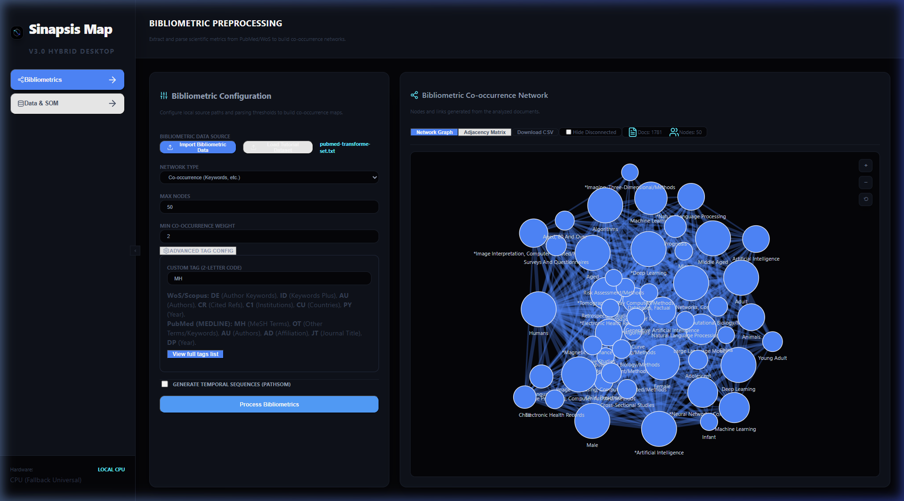
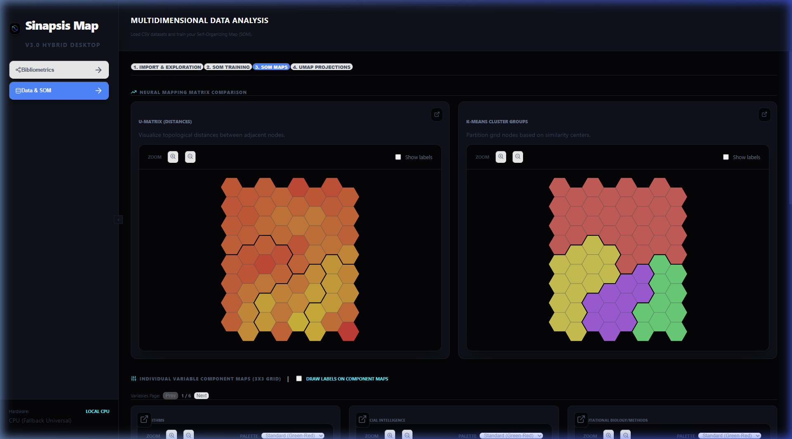
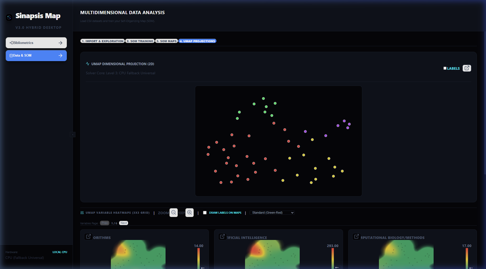

# Tutorial: Creación de Matrices de Coocurrencia y Entrenamiento del SOM en Sinapsis Map

Este tutorial le guiará paso a paso para procesar un conjunto de datos bibliométricos de PubMed, crear una red de coocurrencia basada en términos MeSH (campo `MH`), normalizar la matriz resultante, entrenar una red de mapas autoorganizados (SOM) y visualizar el U-Matrix junto con la proyección dimensional UMAP.

Para este ejercicio utilizaremos el archivo de prueba:
`pubmed-transforme-set.txt`

---

## 1. Preprocesamiento de Datos Bibliométricos

El primer paso consiste en cargar el archivo de datos y extraer la red de coocurrencia para los términos MeSH.

1. Abra la aplicación en su navegador (habitualmente en [http://localhost:5173](http://localhost:5173)).
2. Asegúrese de estar en la pestaña **Bibliometrics** (icono de red en la barra lateral izquierda).
3. Haga clic en **Import Bibliometric Data** y seleccione el archivo `pubmed-transforme-set.txt` desde su Escritorio.
4. En el panel de **Bibliometric Configuration**, configure los siguientes parámetros:
   - **Network Type**: Seleccione `Co-occurrence (Keywords, etc.)`.
   - **Custom Tag**: Ingrese `MH` (para MeSH Headings/Terms).
   - **Max Terms**: Deje el valor predeterminado (por ejemplo, `50` para extraer los 50 términos más frecuentes).
5. Desplácese hacia abajo y presione el botón **Process Bibliometrics**.
6. Una vez completado el procesamiento, se renderizará de forma interactiva la red de coocurrencia de los términos MeSH en el panel central.

---

## 2. Carga y Normalización en Data & SOM

Una vez generada la matriz de coocurrencia, debemos enviarla al espacio de trabajo del SOM para normalizarla y entrenarla.

1. Haga clic en la pestaña **Data & SOM** (icono de base de datos en la barra lateral izquierda).
2. Aparecerá un cuadro de diálogo del navegador preguntando si desea reemplazar los datos actuales en el SOM con la nueva red bibliométrica calculada. Presione **Aceptar (OK)** o **Sí**.
3. En la pestaña secundaria **1. Import & Exploration**, desplácese hasta la sección **Data Normalization & Scaling**.
4. Seleccione el método de normalización **Cosine** (Coseno). Esto es muy recomendable para matrices de coocurrencia ya que mide la similitud angular entre los vectores de términos independientemente de su frecuencia absoluta.

---

## 3. Configuración y Entrenamiento del SOM

Con la matriz normalizada, pasamos al entrenamiento del mapa autoorganizado.

1. Haga clic en la pestaña secundaria **2. SOM Training** en la parte superior.
2. Deje los parámetros por defecto o edítelos:
   - **Grid Size**: `8 x 8` (64 neuronas).
   - **Training Method**: `Batch` (aprovecha la aceleración PyTorch multicore/GPU).
   - **Iterations**: `100`.
   - **Run UMAP Projection**: Asegúrese de que esté activado (permite proyectar los datos de alta dimensión a un espacio 2D).
3. Presione el botón **Train SOM Grid** en la parte inferior del panel de configuración.
4. El backend ejecutará la optimización mediante PyTorch de forma paralela. En unos segundos, el mapa estará listo y se mostrarán automáticamente los gráficos de análisis.

---

## 4. Visualización de Mapas y Proyección UMAP

Una vez finalizado el entrenamiento, podemos explorar la topología de los datos a través de las diferentes vistas.

1. En la subpestaña **3. SOM Maps**, puede alternar entre:
   - **U-Matrix**: Muestra la distancia media entre neuronas vecinas. Las zonas claras/claras representan valles (similitud alta), y las oscuras representan barreras o fronteras topológicas.
   - **K-Means Clusters**: Muestra la agrupación automática de las neuronas en agrupaciones de color.
   - **Hit Frequencies**: Indica la cantidad de términos asignados a cada neurona del mapa.
2. Haga clic en la subpestaña **4. UMAP Projections** para ver la reducción dimensional de los términos MeSH en un gráfico de dispersión bidimensional interactivo, lo que permite comparar agrupaciones directamente con la estructura del SOM.

---

## Grabación en Video del Proceso Completo

Puede ver una demostración interactiva en video de todo el flujo automatizado que acabamos de realizar en el siguiente archivo:

