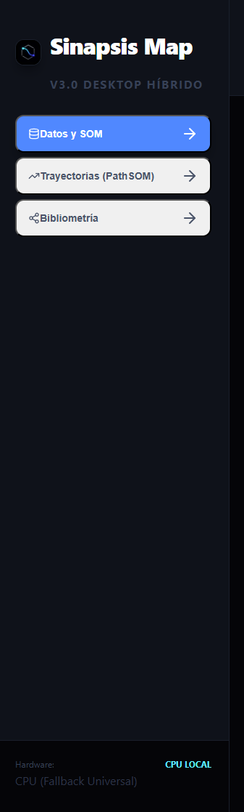
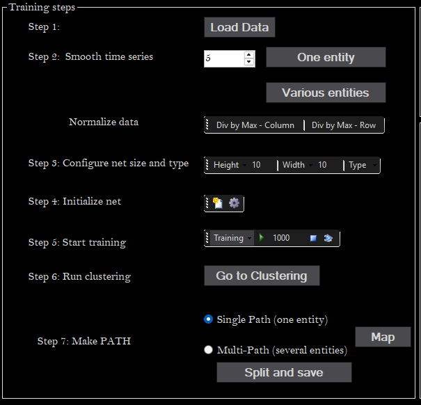

1. Traducir al inglés. Todos los textos serán en inglés.
2. Hacer la barra laterar ocultable.
   
3. Pantalla para el botón Data y SOM de la barra lateral.

   Organizar el panel central en pestañas horizontales: 1. Importación y Exploración de Datos, 2. Training, 3. SOM Maps, 4. UMAP.

   En la pestaña  "Importación y Exploración de Datos"  la Importación de Datos es un botón pequeño para que el resto se utilice para mostrar la información de los datos. Generaremos automáticamente los boxplots interactivos de las primeras 9 variables y los motramos en tres columnas.

   En la pestaña 2. Training va la Configuración de Entrenamiento

   En la pestaña SOM Maps vamos a mostrar en dos columnas la U-Matrix y el Mapa de clustering. Mostramos 9 mapas de compoentes en 3 columnas (el resto tendrán que visualizarse ocultando otros mapas de componentes par ano saturar la memoria del navegador). Los mapas tendrán la posibiliad de verse en una ventana nueva.
   En esta

   Mover Umap a la pestaña 4.

   # Pantalla para el botón Data y SOM de la barra lateral. Revisar pasos en  C:\Users\jlja\Documents\LabSOM_Github\PathSOM y la imagen siguiente.

   
